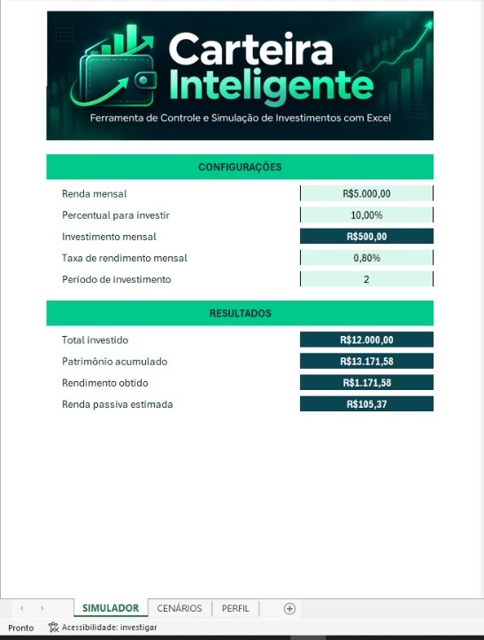
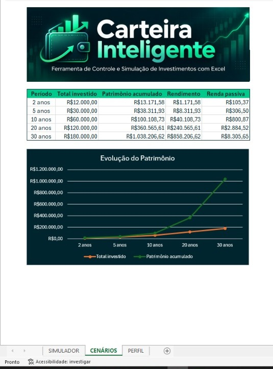
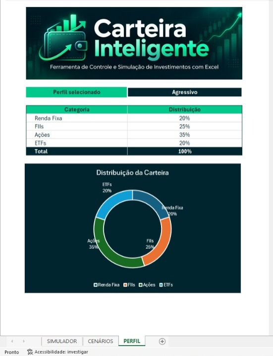

  

# Carteira Inteligente

Ferramenta de controle e simulação de investimentos desenvolvida em Excel como projeto do bootcamp Santander Excel 2026 da DIO.

## Sobre o projeto

O **Carteira Inteligente** é uma ferramenta desenvolvida em Microsoft Excel para auxiliar na simulação e visualização da evolução de investimentos ao longo do tempo.

A planilha permite informar renda mensal, percentual destinado aos investimentos, taxa de rendimento e período de investimento, calculando automaticamente o valor dos aportes, patrimônio acumulado e rendimentos.

## Funcionalidades

- Cálculo automático do investimento mensal
- Simulação de juros compostos
- Cálculo do patrimônio acumulado
- Cálculo do rendimento obtido
- Estimativa de renda passiva
- Projeções para diferentes períodos
- Perfis de investidor
- Distribuição de carteira por perfil
- Gráficos dinâmicos
- Validação de dados com lista suspensa

## Estrutura da planilha

### SIMULADOR

Permite configurar:

- Renda mensal
- Percentual para investir
- Taxa de rendimento mensal
- Período de investimento

E apresenta automaticamente:

- Investimento mensal
- Total investido
- Patrimônio acumulado
- Rendimento obtido
- Renda passiva estimada

### CENÁRIOS

Apresenta projeções para diferentes horizontes de investimento:

- 2 anos
- 5 anos
- 10 anos
- 20 anos
- 30 anos

Também possui um gráfico de evolução comparando o total investido com o patrimônio acumulado.

### PERFIL

Permite selecionar um perfil de investidor:

- Conservador
- Moderado
- Agressivo

A distribuição da carteira e o gráfico são atualizados automaticamente.

### DADOS

Contém as tabelas auxiliares utilizadas pelas fórmulas e pela distribuição dos perfis.

## Recursos do Excel utilizados

- Fórmulas financeiras
- Função VF
- ÍNDICE
- CORRESP
- SOMA
- Validação de Dados
- Nomes Definidos
- Formatação personalizada
- Gráficos de linha
- Gráfico de rosca
- Proteção de células

## Exemplo de simulação

Considerando:

- Renda mensal: R$ 5.000,00
- Percentual investido: 10%
- Investimento mensal: R$ 500,00
- Taxa mensal: 0,8%
- Período: 10 anos

A ferramenta calcula aproximadamente:

- Total investido: R$ 60.000,00
- Patrimônio acumulado: R$ 100.108,73
- Rendimento obtido: R$ 40.108,73
- Renda passiva estimada: R$ 800,87

## Demonstração

### Simulador

A aba principal permite configurar os parâmetros da simulação e visualizar automaticamente os resultados do investimento.

  

### Cenários de investimento

A ferramenta apresenta projeções para diferentes períodos, comparando o total investido com o patrimônio acumulado ao longo do tempo.

  

### Perfil do investidor

O usuário pode selecionar entre os perfis Conservador, Moderado e Agressivo. A distribuição da carteira e o gráfico são atualizados automaticamente.

  

## Tecnologias e ferramentas

- Microsoft Excel
- Git
- GitHub
- Visual Studio Code

## Observação

Os valores apresentados são apenas simulações educacionais e não constituem recomendação de investimento.

## Autor

Leandro Rodrigues da Silva

Projeto desenvolvido como parte do bootcamp **Santander Excel 2026 - DIO**.